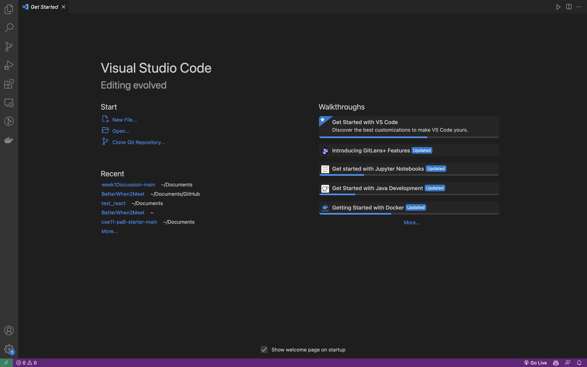

# Set Up Your Remote Server Tutorial
---

## Step 1: Installing VScode
*Note skip if you already had VScode installed beforehand*
If you don't have VScode installed follow the steps below:
1. Follow this link to go to the VScode download page: [Link](https://code.visualstudio.com/download)
2. Click the appropriate download for your OS (Windows, Linux, Mac)
3. Once you download, unpackage the Zip and agree to Terms

*You should end up with something like the picture above*
Congrats You have just installed VSCode!!!

 
