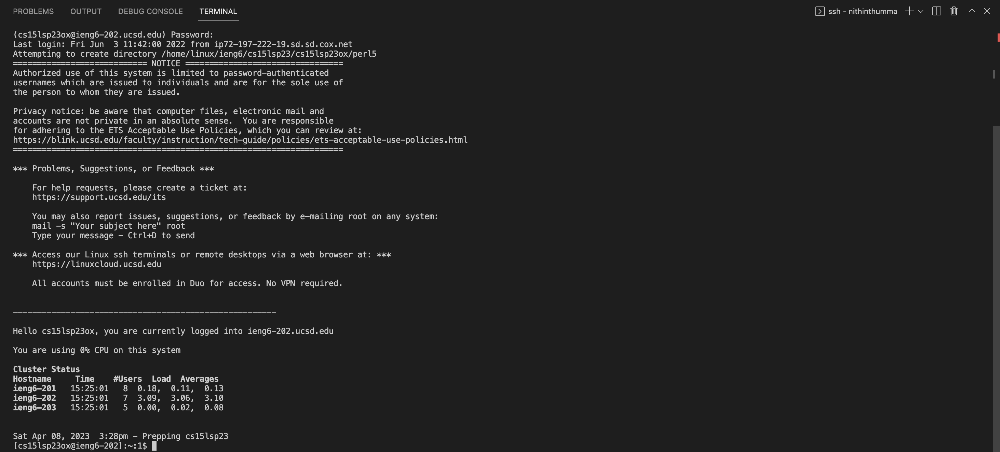
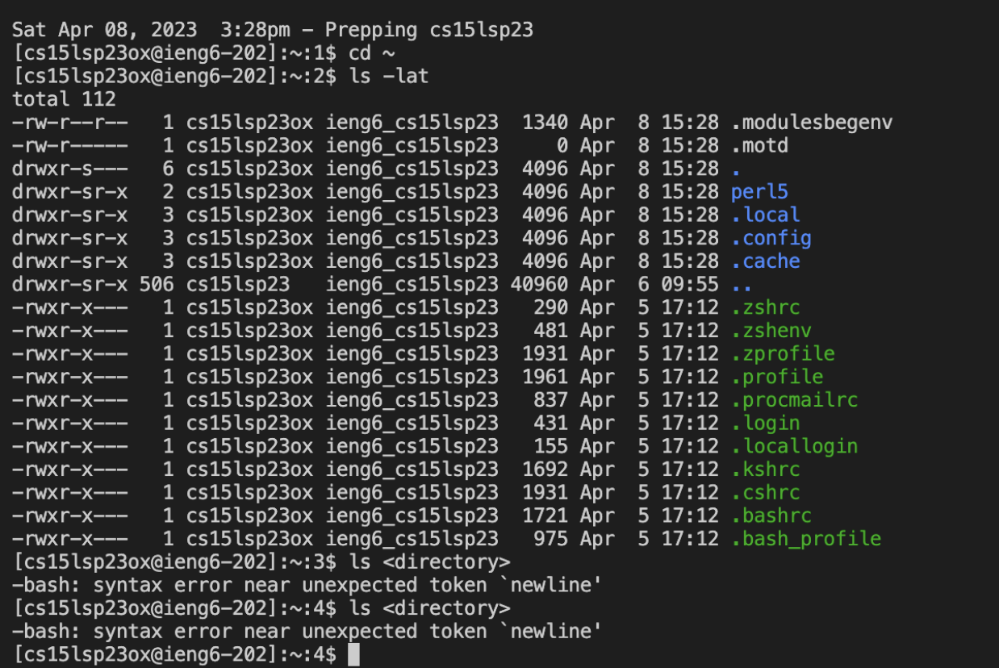

# Set Up Your Remote Server Tutorial
---

## Step 1: Installing VScode
*Note skip if you already had VScode installed beforehand*
If you don't have VScode installed follow the steps below:
1. Follow this link to go to the VScode download page: [Link](https://code.visualstudio.com/download)
2. Click the appropriate download for your OS (Windows, Linux, Mac)
3. Once you download, unpackage the Zip and agree to Terms

*You should end up with something like the picture above*
,Congrats You have just installed VSCode!!!

## Step 2: Remotely Connecting
1. Go to this link to find your CSE 15L account: [Link](https://sdacs.ucsd.edu/~icc/index.php) *It should start with cs15l* 
2. Once found note it down, then open up the terminal in your VScode
3. When you have the terminal open, enter the following command: ssh *[Insert your cs15l account]*@ieng6.ucsd.edu
4. Another prompt will appear where you will enter "yes" into the terminal
5. After that it will ask for a password, where you will enter the password for your cs15l account Note:*It may appear that it is not registering keystokes, but it is*

The image above should be your result after following the steps correctly

## Step 3: Trying Some Commands
Now that you are remotely connected you can try out some commands

*Example above*
1. Play with some commands provided here: cd, ls, mkdir, cp, cd ~, ls -lat, ls <directory>
2. Observe what they do, and try to pinpoint the purpose for each command
3. Do any of the commands cause errors (look at ls <directory>)
 
 
## Congrats you have completed the Remote Server Tutorial!!!

 
