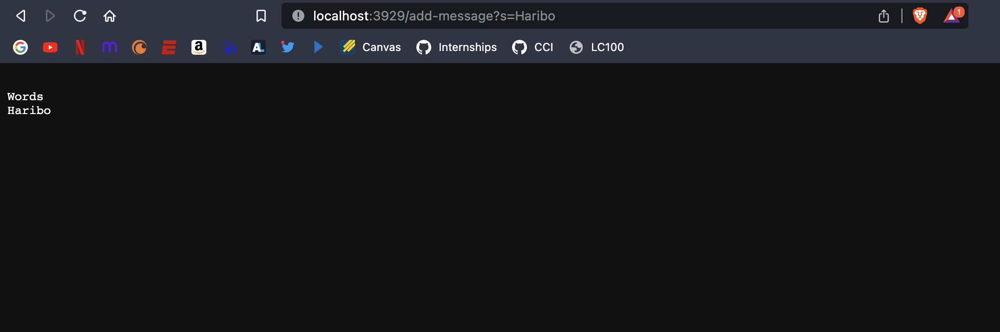
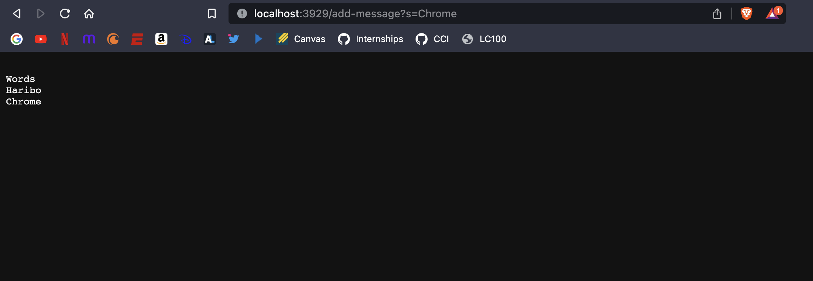
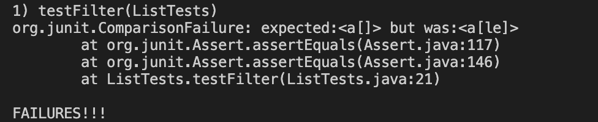
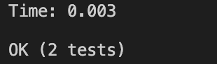

# Lab Report 2
---

## Part 1: StringServer
Code:
```
import java.io.IOException;
import java.net.URI;

class Handler implements URLHandler {
    String statement = "";

    public String handleRequest(URI url) {
        if (url.getPath().equals("/")) {
            return String.format(statement);
        } else if (url.getPath().equals("/add-message")) {
            String[] parameters = url.getQuery().split("=");
            if (parameters[0].equals("s")) {
                statement += "\n" +parameters[1];
            }
            
            return String.format(statement);
        } else {
            return "404 Not Found!";
        }
    }
}

class StringServer {
    public static void main(String[] args) throws IOException {
        if(args.length == 0){
            System.out.println("Missing port number! Try any number between 1024 to 49151");
            return;
        }

        int port = Integer.parseInt(args[0]);

        Server.start(port, new Handler());
    }
}
```

*Added the words "Words" and "Haribo"*

*Added the word "Chrome"*

1. For both screenshots the main method was initailly called to start the server and both would call the handler method which would look for the path the user entered.
2. For both screenshots the relevant arguments for the main method is an argument the user passes which would be the port number and for handler would be the word the user would pass in the form add-message?s=[WORD]. The relevant fields are int port which hold the port number, String statement which holds the words the user passes in, and String[] parameters which holds the arguments the user passes in and s.
3. In the first screenshot the values of statement change with Haribo added onto it with a new line before and parameters would also include Haribo at parameters[1]. For the second screenshot the values of statement change with a new line added before the Chrome is added on the String and parameters would have Chrome at parameters[1].


## Part 2: Lab 3 Bug
There was a bug in the Filter() method in the ListExamples class.  

Method:
 ```
 static List<String> filter(List<String> list, StringChecker sc) {
    List<String> result = new ArrayList<>();
    for(String s: list) {
      if(sc.checkString(s)) {
        result.add(0,s);
      }
    }
    return result;
  }
```
This test showcases the failure with a failure inducing input:
```
 @Test
    public void testFilter(){
        List <String> list = new ArrayList<>();
        list.add("a");
        list.add("abe");
        list.add("c");
        list.add("ale");
        list.add("e");
        StringChecker s = new StringChecker(){
            public boolean checkString(String s){
                return s.contains("a");
            }
        };
        List <String> result = ListExamples.filter(list,s);
        assertEquals(3, result.size());
        assertEquals("a", result.get(0));
        assertEquals("abe", result.get(1));
        assertEquals("ale", result.get(2));
        
    }
 ```
 This test doesn't induce the bug:
 ```
 @Test
    public void testFilter(){
        List <String> list = new ArrayList<>();
        list.add("a");
        list.add("c");
        list.add("e");
        StringChecker s = new StringChecker(){
            public boolean checkString(String s){
                return s.contains("a");
            }
        };
        List <String> result = ListExamples.filter(list,s);
        assertEquals(1, result.size());
        assertEquals("a", result.get(0));    
    }
 ```
 Symptoms of running both tests:
 Test that induces bug:
 
 *The output is in the wrong order*  
 
 Test that doesn't induce bug (The 2nd test is testMerge() which is irrelevant for this):
 
 *The output is correct*  
 
 The method before bug was removed:  
 
 Method:
 ```
 static List<String> filter(List<String> list, StringChecker sc) {
    List<String> result = new ArrayList<>();
    for(String s: list) {
      if(sc.checkString(s)) {
        result.add(0,s);
      }
    }
    return result;
  }
```
The method after bug was removed:  

Method:
 ```
 static List<String> filter(List<String> list, StringChecker sc) {
    List<String> result = new ArrayList<>();
    for(String s: list) {
      if(sc.checkString(s)) {
        result.add(s);
      }
    }
    return result;
  }
```
Changing the result.add(0,s) to result.add(s) fixes the bug because it preserves the order the elements were added to the list which it the correct way it should be done as .add(0,s) inputs the String in the 0 index no matter what leaving the result list in reverse order.

## Part 3: What I Learned

In labs 2 and 3 I learned how to make a backend system for a webserver which was actually way less complicated than I thought it would be. Looking at it it makes total sense in how Server.java is implemented and how the handler method works as it looks for a correct path and does something with the variables in the code to display a correct output depending on the path. I also learned how this webserver implementation works between different computers when we worked with a partner while we were on the same remote server. Overall, it was really cool working and learning about the webserver.
 
 

