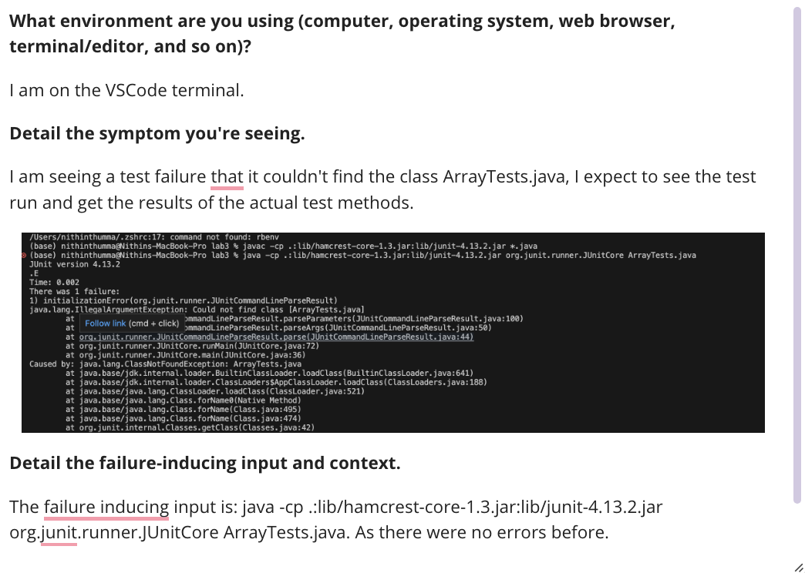
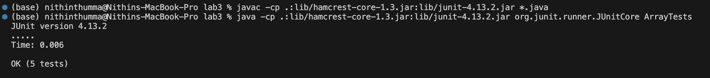

# Debugging
---
## Original Post of the Bug:

---
## TA Response

Hey is your class actually called ArrayTests.java? If it is not (most likely not) drop the .java when running the second command because the second command looks for the class to compile which is most likely ArrayTests.

---

## Student trying to fix the bug

Fixing the bug:

The bug was was the TA said in that the .java should be dropped when running the second command as ArrayTests.java is not a class.

---
## Bug Report

The file needed was the ArrayTests.java file, which was implied to be in the same directory as the file it was testing. The contents of the file are the same before fixing the bug. The command line I did to trigger the bug is in the first image. To fix the bug .java was dropped from the second command.

---
## Reflection 
Something cool I learned over the second half of the quarter was Vim. I didn't know you could meticulously edit files in the terminal and Vim helps out in doing that. I could see it being very useful in the future for quick edits and maybe even longer edits.  

